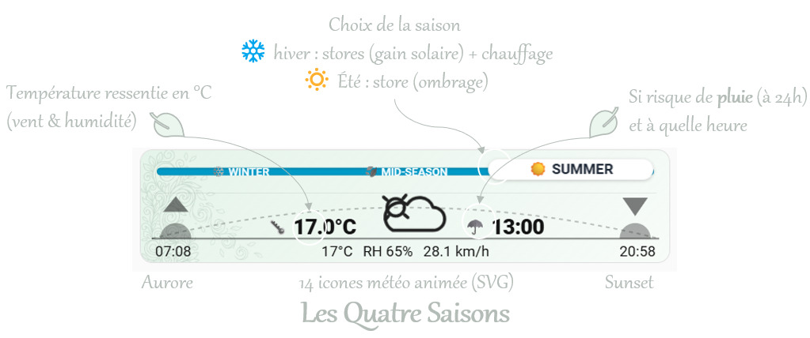
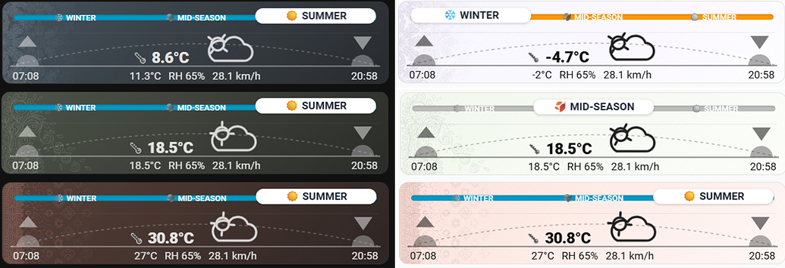

[English](README.md) · **Français**


# Season Card — carte saisons + météo compacte (Lovelace)

> [!NOTE]
> Pourquoi ce n'est pas une carte météo de plus…  
> C'est avant tout un sélecteur unique de **MODE** (pour activer ou désactiver le mode chauffage, climatisation, etc.) — soit [manuel](#a-usage-en-sélecteur-manuel-de-mode), soit [automatique](#b-usage-en-mode-automatique) si vous utilisez l'intégration native **Season** de Home Assistant.

Carte Lovelace pour Home Assistant : **mode sélecteur** (`input_select`) ou **mode capteur** (`sensor.season`), avec **bandeau météo** (température ressentie, icône condition, pluie 24 h, lever/coucher du soleil) et **ambiance** (dégradé + motifs) liée à la température extérieure.

**Dépôt** : [https://github.com/ebozonne/season-card](https://github.com/ebozonne/season-card)

---

## Aperçu



- **Température ressentie** — approximation simple (vent et humidité).
- **Fond coloré + motifs** (PNG) — teinte liée à la température ; adaptation **clair / sombre** au thème.
- **Parapluie** — affichage si risque de pluie dans les **24 h** (prévisions horaires HA).
- **Soleil** — heures de lever et de coucher.
- **Mode sélecteur (`input_select`)** — rail pilotable (usage chauffage / automations).
- **Mode capteur (`sensor.season`)** — rail non réglable, piloté par l’état de Home Assistant.



Pour la carte **avec météo**, la configuration **standard** comporte **trois** lignes YAML : `type`, `entity`, `weather_entity`. Cette dernière reste **votre** entité (`weather.*`) — l’exemple `weather.forecast_maison` est seulement celui d’une instance de référence.

Sans `weather_entity`, le bandeau météo reste masqué (le curseur saison fonctionne seul). Les prévisions pour le **☂️** dépendent de l’entité météo (`weather.get_forecasts` ou équivalent) ; sinon le bloc pluie peut rester vide.

> [!IMPORTANT]
> Le domaine **`weather`** n’est pas un « paquet à installer » pour la carte : c’est le type d’entité que vous pointez dans **`weather_entity`**.

---

## (A) USAGE en sélecteur manuel de MODE

> [!IMPORTANT]
> Prérequis : helper **`input_select`** avec **exactement les options** que vous utiliserez partout (automations, scripts, etc.)

> [!TIP]
> Exemple : `input_select.season` — nom d’entité **`season`**, nom affiché **SEASON**, icône **`mdi:sun-snowflake-variant`** :

```yaml
input_select:
  season:
    name: SEASON
    icon: mdi:sun-snowflake-variant
    options:
      - "❄️ WINTER"
      - "🍂 MID-SEASON"
      - "☀️ SUMMER"
```
### Configuration du mode A

La carte affiche les **libellés tels qu’ils sont définis** dans le helper (ordre YAML = positions gauche → droite sur le rail). Les couleurs du rail s’appuient sur des mots-clés dans le texte de l’option (par ex. `WINTER`, `MID` / mi-saison, `SUMMER` / été). La météo est optionnelle.

```yaml
type: custom:season-card
entity: input_select.season
weather_entity: weather.forecast_maison   # [OPTION] remplacer par votre weather.*
```

- **`type`** et **`entity`** : requis côté Lovelace / carte (`entity` = votre `input_select`).
- **`weather_entity`** : en option vous choisissez **quelle** entité `weather.*` alimente le bandeau ; l’exemple ci-dessus n’est qu’une valeur d’instance.
- **Lever / coucher** : par défaut **`sun.sun`** (attributs `next_rising` / `next_setting`, affichés dans le **fuseau horaire de Home Assistant**). Pour une autre entité, la carte affiche son **`state`** ; surcharge possible avec `weather_sunrise_entity` et `weather_sunset_entity`.

---

## (B) USAGE en MODE automatique

> [!IMPORTANT]
> Prérequis: avoir déjà une entité active pour sélectionner la saison ou le mode. Soit l'intégration par défaut SEASON de Home Assistant (Paramètres>Appareils et Services>Ajouter une intégration), soit votre propre helper `input_select` que vous utilisez habituellement pour activer ou désactiver votre chauffage, climatisation ou autre.

Comportement de ce mode :
- rail **non interactif** (le curseur suit l’état du capteur),

Si c'est SEASON de Home Assistant qui est utilisé comme dans l'exemple ci-après, alors :
- 4 positions fixes : `winter` (gauche), `spring`, `summer`, `autumn` (droite),
- couleur du rail basée sur la saison : `winter` et `summer` colorées, `spring` / `autumn` grisées,
- libellé actif localisé avec emoji (ex. ❄️ / 🍃 / ☀️ / 🍂).

### Configuration du mode B

La carte affiche les **libellés tels qu’ils sont définis** dans le helper (ordre YAML = positions gauche → droite sur le rail).

Exemple:
```yaml
type: custom:season-card
entity: sensor.season
weather_entity: weather.forecast_maison   # [OPTION] remplacer par votre weather.*
```

Après modification du YAML : vérifier la configuration Home Assistant, puis recharger les **entités d’entrée** (ou redémarrer si votre mode d’édition l’exige).

---

## Installation via HACS

1. **HACS** → menu **⋮** → **Dépôts personnalisés** → URL `https://github.com/ebozonne/season-card`, catégorie **Dashboard** (plugin Lovelace).
2. **HACS** → **Frontend** (ou équivalent) → **Season Card** → **Télécharger**.
3. Ajoutez la carte au tableau (`Ajouter une carte` → **Season Card**, ou YAML `type: custom:season-card`).

---

## Installation manuelle (sans HACS)

1. Copier **le contenu** du dossier **`dist/`** de ce dépôt vers **`config/www/season-card/`** (à la racine de ce dossier : `season-card.js`, `temperature-colorscale.json`, dossiers `season-icons/`, `meteocons-mono-icons/`, `meteocons-fill-icons/`, `season-motifs/`, etc.).
2. **Paramètres** → **Tableaux de bord** → **Ressources** → **Ajouter une ressource** : URL **`/local/season-card/season-card.js`**, type **JavaScript module**. En cas de cache navigateur tenace, vous pouvez ajouter un paramètre de version dans l’URL (`?v=…`).

---

## Choisir un pack d’icônes météo

La carte est livrée avec **trois packs** d’icônes condition (mêmes 15 conditions, même rendu). Réglage via la clé **`weather_icon_set`** :


| Valeur                  | Style                                                            | Couleur                                              |
| ----------------------- | ---------------------------------------------------------------- | ---------------------------------------------------- |
| `season` *(par défaut)* | Animations maison, monochromes                                   | Pilotée par `weather_color` (suit le thème)          |
| `meteocons-mono`        | [Meteocons](https://meteocons.com/) monochromes animées          | Pilotée par `weather_color` (suit le thème)          |
| `meteocons-fill`        | [Meteocons](https://meteocons.com/icons/?style=fill) en couleurs | Couleurs gradient d’origine (indépendantes du thème) |


```yaml
type: custom:season-card
entity: input_select.season
weather_entity: weather.forecast_maison
weather_icon_set: meteocons-fill   # ou: season | meteocons-mono
```

> Si `weather_icon_set` n’est pas précisé, le pack `season` est utilisé.

---

## Variantes
### slider MODE seul (sans météo)
uniquement le sélecteur saison :
```yaml
type: custom:season-card
entity: input_select.season
```

### météo seule (sans sélecteur)
uniquement le bandeau météo, sans `entity` :
```yaml
type: custom:season-card
weather_entity: weather.forecast_maison
```

### MODE auto seul
uniquement le MODE défini par votre entité, p. ex. le capteur (ex. `sensor.season`):
```yaml
type: custom:season-card
entity: sensor.season
```

---

## Options démo (hors usage courant)

À utiliser **ponctuellement** pour tester l’UI, puis retirer ou remettre aux valeurs par défaut.


| Paramètre                     | Défaut     | Exemple  | Rôle                                                                                                                            |
| ----------------------------- | ---------- | -------- | ------------------------------------------------------------------------------------------------------------------------------- |
| `external_temp`               | *(absent)* | `32`     | Force une température **°C** (motifs, ambiance, ressenti, **T** affichée) sans modifier la météo réelle.                        |
| `weather_rain_umbrella_force` | `false`    | `true`   | Affiche le bloc **☂️** comme s’il y avait une alerte, **sans** appeler les prévisions.                                          |
| `season_force`                | *(absent)* | `autumn` | **Mode `sensor.season` uniquement** : force l’affichage d’une saison (`winter`, `spring`, `summer`, `autumn`) pour test visuel. |


---

## Licence

Voir le fichier [`LICENSE`](LICENSE) (MIT).
