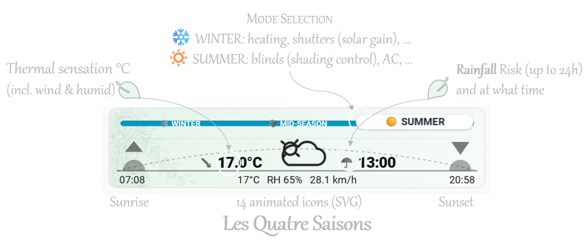

**English** · [Français](README.fr.md)

[](https://hacs.xyz/)

# Season Card — seasons + compact weather card (Lovelace)

> [!NOTE]
> Why this isn't yet another weather card…  
> First and foremost it's a single **MODE** selector (to enable or disable heating, AC, etc.) — either [manual](#a-detailed-usage--manual-mode-selector) or [automatic](#b-detailed-usage--automatic-mode) if you use Home Assistant's native **Season** integration.

A Lovelace card for Home Assistant: **selector mode** (`input_select`) or **sensor mode** (`sensor.season`), with a **weather strip** (feels-like temperature, condition icon, 24 h rainfall, sunrise/sunset) and **ambiance** (gradient + patterns) tied to the outside temperature.

**Repository**: [https://github.com/ebozonne/season-card](https://github.com/ebozonne/season-card)

---

## Overview



- **Feels-like temperature** — simple approximation (wind and humidity).
- **Colored background + patterns** (PNG) — tint linked to temperature; **light / dark** theme adaptation.
- **Umbrella** — shown if there is a risk of rain within the next **24 h** (HA hourly forecasts).
- **Sun** — sunrise and sunset times.
- **Selector mode (`input_select`)** — interactive rail (heating / automation use).
- **Sensor mode (`sensor.season`)** — non-adjustable rail, driven by Home Assistant's state.


---

## Installation

### Via HACS (recommended)

[](https://my.home-assistant.io/redirect/hacs_repository/?owner=ebozonne&repository=season-card&category=plugin)

1. Click the button above — it opens your Home Assistant instance directly on the HACS dialog with this repository pre-filled.  
   *(Manual fallback: HACS → ⋮ menu → **Custom repositories** → URL `https://github.com/ebozonne/season-card`, category **Dashboard**.)*
2. In HACS, click **Download** on the **Season Card** entry.
3. Add the card to your dashboard (`Add card` → **Season Card**, or YAML `type: custom:season-card`).

### Manual (without HACS)

1. Copy **the contents** of this repository's **`dist/`** folder into **`config/www/season-card/`** (at the root of that folder: `season-card.js`, `temperature-colorscale.json`, folders `season-icons/`, `meteocons-mono-icons/`, `meteocons-fill-icons/`, `season-motifs/`, etc.).
2. **Settings** → **Dashboards** → **Resources** → **Add resource**: URL **`/local/season-card/season-card.js`**, type **JavaScript module**. If the browser cache is stubborn, you can append a version parameter to the URL (`?v=…`).

---

## Quick start

The **standard** configuration takes **three** YAML lines: `type`, `entity`, `weather_entity`.

```yaml
type: custom:season-card
entity: input_select.season              # or sensor.season for auto mode
weather_entity: weather.forecast_maison  # optional — replace with your weather.*
```

> [!IMPORTANT]
> The **`weather`** domain is not a "package to install" for the card: it's the entity type you point to in **`weather_entity`**.

Common minimal variants:

```yaml
# Slider only (no weather strip)
type: custom:season-card
entity: input_select.season
```

```yaml
# Weather strip only (no slider)
type: custom:season-card
weather_entity: weather.forecast_maison
```

```yaml
# Auto mode only (rail driven by sensor)
type: custom:season-card
entity: sensor.season
```

If your `entity` doesn't exist yet, jump to the matching section below: [(A) manual selector](#a-detailed-usage--manual-mode-selector) or [(B) automatic mode](#b-detailed-usage--automatic-mode).

---

## (A) Detailed usage — manual MODE selector

> [!IMPORTANT]
> Prerequisite: an **`input_select`** helper with **exactly the options** you'll use everywhere (automations, scripts, etc.)

> [!TIP]
> Example: `input_select.season` — entity name **`season`**, display name **SEASON**, icon **`mdi:sun-snowflake-variant`**:

```yaml
input_select:
  season:
    name: SEASON
    icon: mdi:sun-snowflake-variant
    options:
      - "❄️ WINTER"
      - "🍂 MID-SEASON"
      - "☀️ SUMMER"
```

The card displays **labels exactly as defined** in the helper (YAML order = positions left → right on the rail). Rail colors rely on keywords in the option text (e.g. `WINTER`, `MID` / mid-season, `SUMMER`). Weather is optional.

```yaml
type: custom:season-card
entity: input_select.season
weather_entity: weather.forecast_maison   # [OPTIONAL] replace with your weather.*
```

- **`type`** and **`entity`**: required on the Lovelace / card side (`entity` = your `input_select`).
- **`weather_entity`**: optionally, you choose **which** `weather.*` entity feeds the strip; the example above is just an instance value. Without it, the weather strip stays hidden.
- **Sunrise / sunset**: by default **`sun.sun`** (attributes `next_rising` / `next_setting`, displayed in **Home Assistant's time zone**). For any other entity, the card displays its **`state`**; can be overridden with `weather_sunrise_entity` and `weather_sunset_entity`.

---

## (B) Detailed usage — automatic MODE

> [!IMPORTANT]
> Prerequisite: already have an active entity to select the season or mode. Either Home Assistant's default **Season** integration (Settings → Devices and Services → Add Integration), or your own `input_select` helper that you typically use to turn your heating, AC or other systems on/off.

Behavior of this mode:
- rail is **non-interactive** (the slider follows the sensor's state).

If Home Assistant's **Season** integration is used as in the example below:
- 4 fixed positions: `winter` (left), `spring`, `summer`, `autumn` (right),
- rail color based on the season: `winter` and `summer` colored, `spring` / `autumn` grayed,
- active label localized with an emoji (e.g. ❄️ / 🍃 / ☀️ / 🍂).

The card displays **labels exactly as defined** in the helper (YAML order = positions left → right on the rail).

```yaml
type: custom:season-card
entity: sensor.season
weather_entity: weather.forecast_maison   # [OPTIONAL] replace with your weather.*
```

After editing the YAML: check the Home Assistant configuration, then reload **input entities** (or restart if your editing mode requires it).

---

## Choosing a weather icon pack

The card ships with **three** condition icon packs (same 15 conditions, same rendering). Set via the **`weather_icon_set`** key:


| Value                     | Style                                                              | Color                                                  |
| ------------------------- | ------------------------------------------------------------------ | ------------------------------------------------------ |
| `season` *(default)*      | In-house animations, monochrome                                    | Driven by `weather_color` (follows the theme)          |
| `meteocons-mono`          | [Meteocons](https://meteocons.com/) animated monochromes           | Driven by `weather_color` (follows the theme)          |
| `meteocons-fill`          | [Meteocons](https://meteocons.com/icons/?style=fill) in colors     | Original gradient colors (theme-independent)           |


```yaml
type: custom:season-card
entity: input_select.season
weather_entity: weather.forecast_maison
weather_icon_set: meteocons-fill   # or: season | meteocons-mono
```

> If `weather_icon_set` isn't specified, the `season` pack is used.

---

## Demo options (not for everyday use)

Use **occasionally** to test the UI, then remove or reset to defaults.


| Parameter                     | Default    | Example  | Role                                                                                                                            |
| ----------------------------- | ---------- | -------- | ------------------------------------------------------------------------------------------------------------------------------- |
| `external_temp`               | *(absent)* | `32`     | Forces a temperature in **°C** (patterns, ambiance, feels-like, displayed **T**) without changing the actual weather.           |
| `weather_rain_umbrella_force` | `false`    | `true`   | Displays the **☂️** block as if there were an alert, **without** calling forecasts.                                            |
| `season_force`                | *(absent)* | `autumn` | **`sensor.season` mode only**: forces the display of a season (`winter`, `spring`, `summer`, `autumn`) for visual testing.      |


---

## License

See the [`LICENSE`](LICENSE) file (MIT).
